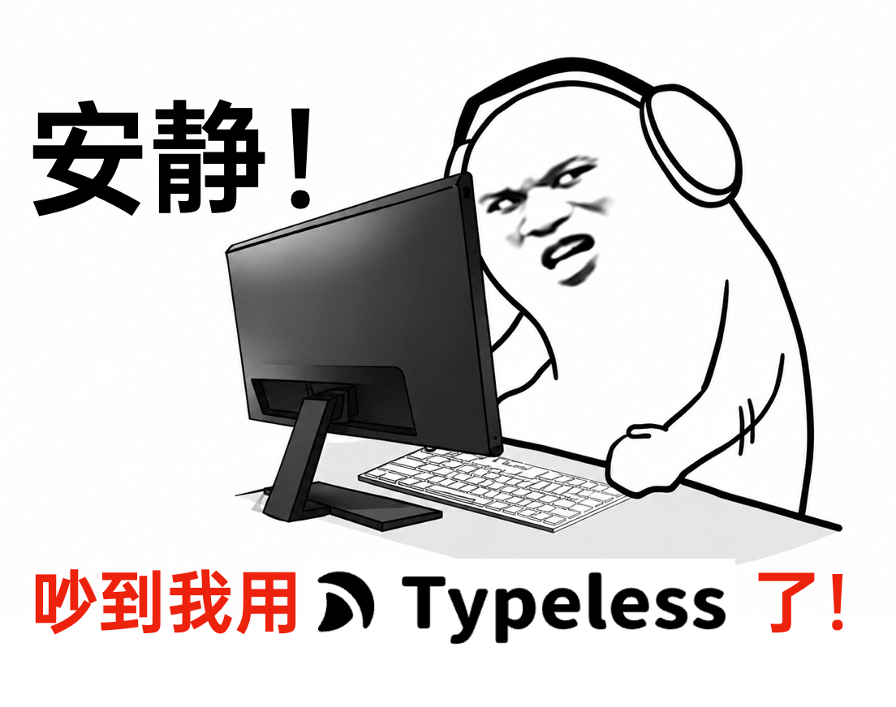
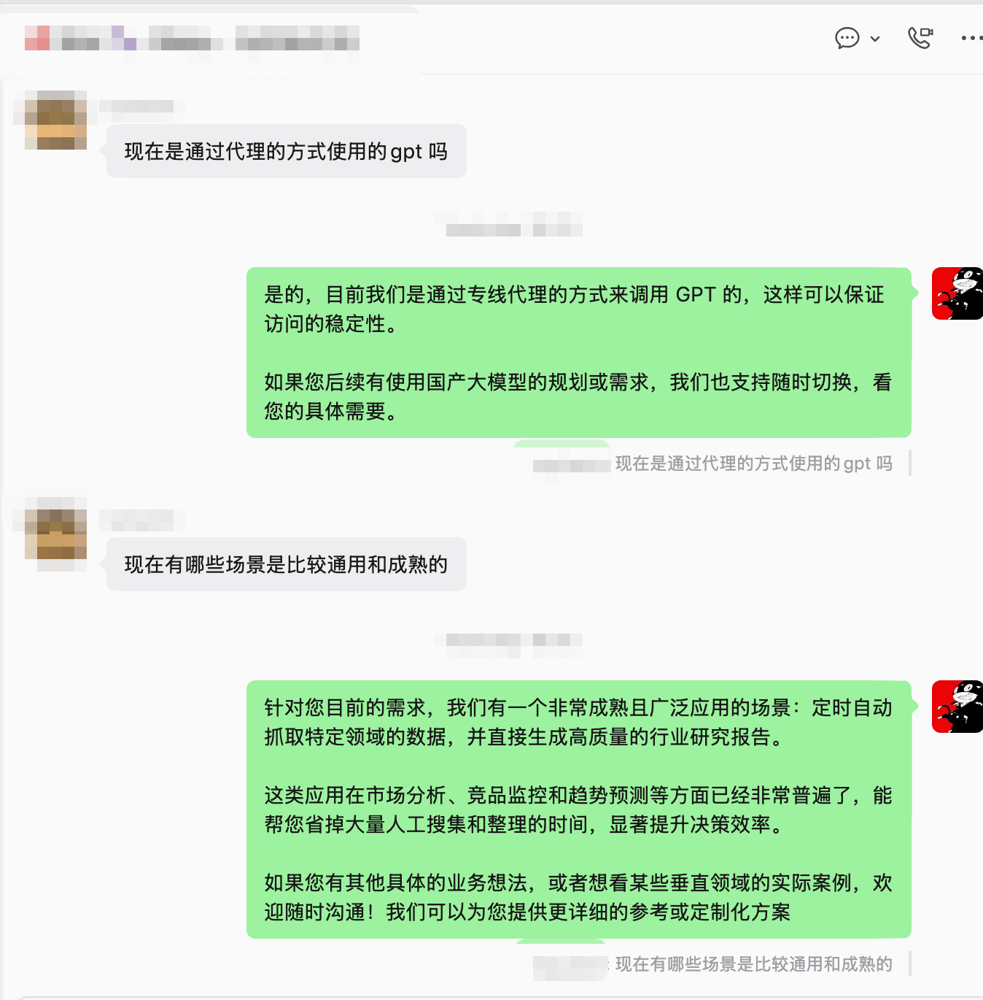
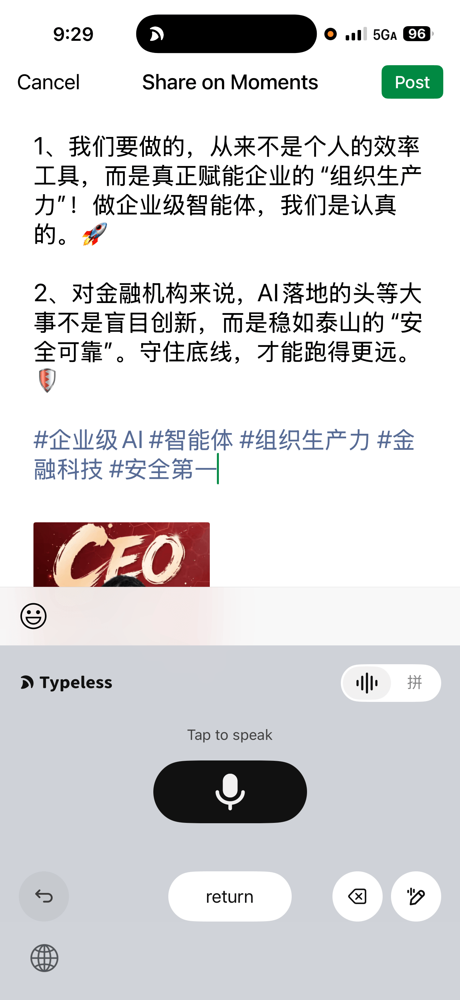
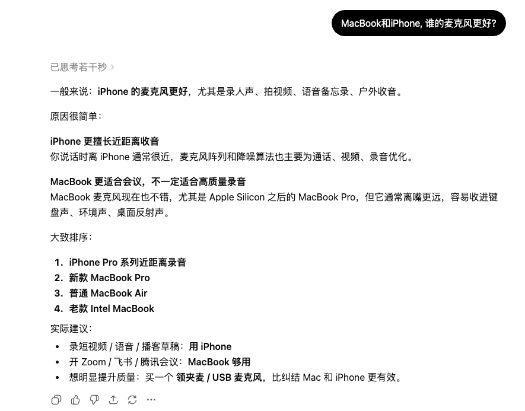
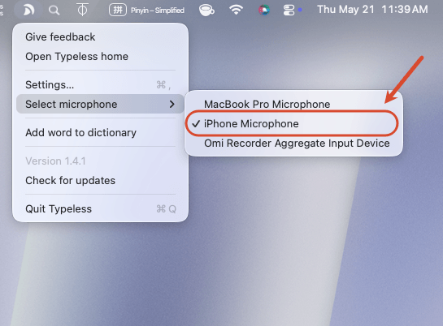

# Typeless实用经验分享

## 通过此链接注册，你和作者都可以获得五美元赠金 https://www.typeless.com/refer?code=I238ZPZ

## 1. 场景应用

### 回复客户场景：运维感更强的客服

开发者直接和客户对接，讲太多技术细节，并不利于沟通，我们可以在微信输入内容后，让Typeless重新润色，就能获得满运维感的句子

### 转发朋友圈场景：自动生成文案，以及关键词

转发内容的时候，我们可以让Typeless重写润色，Typeless可以把关键词都帮你自动添加好

### 练习英语口语场景：发音自动评价，自动计数

### 海外论坛交流场景：语言自动翻译，灌水Reddit

### 指挥AI赛博领鸡蛋：帮我领一下DFO今天的登陆礼包

### 打工写日报场景：帮我提交一下今天的日报，今天主要工作是巴拉巴拉

## 2. 实用技巧

### MacBook可直接使用iPhone麦克风

用iPhone的麦克风，就可以不用嘴巴贴着键盘录声音了

